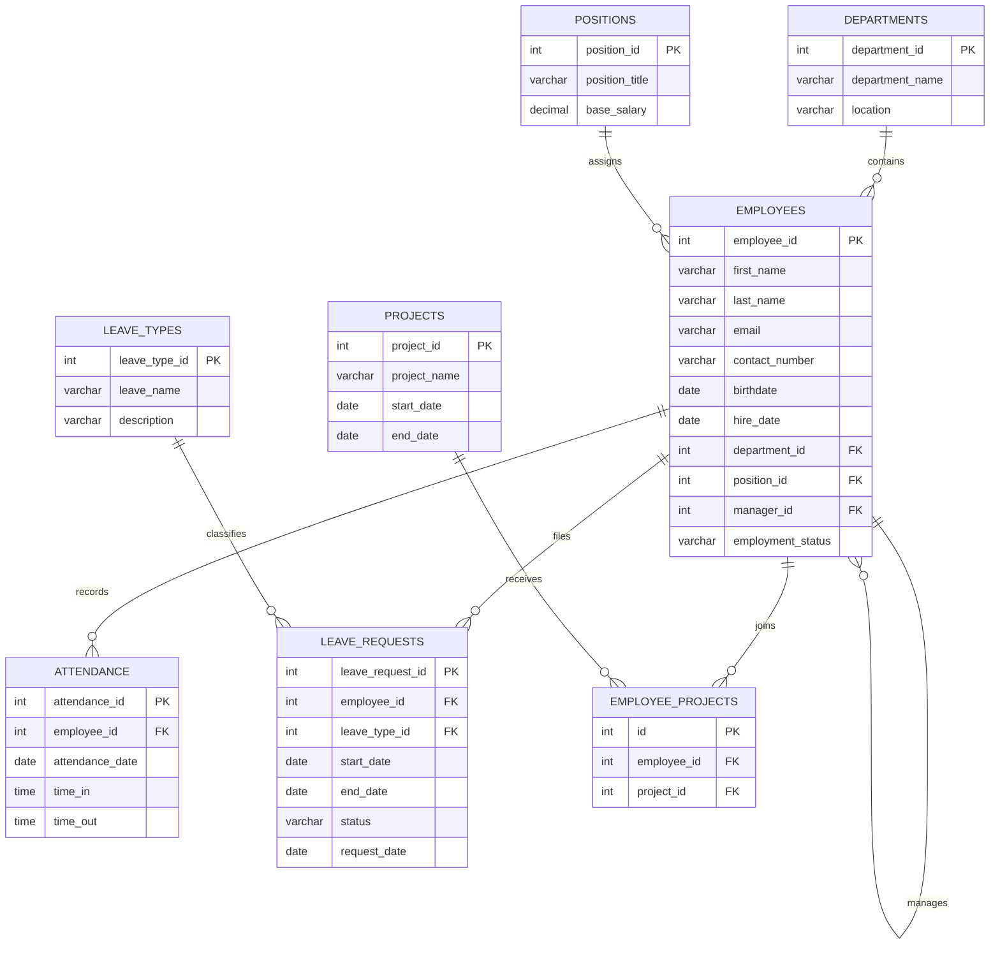

# Page 1: Title Page

## Employee Management System

### Information Management

- Student Name: ______________________
- Section: ______________________
- Instructor: ______________________
- School Year: 2025-2026
- Semester: 2nd Semester

---

# Page 2: Overview of the Project

The Employee Management System is a database-driven application designed to manage company employee records in one organized system. It stores department information, position data, employee profiles, attendance entries, leave requests, project records, and employee project assignments.

The goal of the project is to reduce manual paperwork, improve data consistency, and make employee-related transactions easier to encode, update, search, and report. By using SQL and a relational database structure, the system keeps connected records accurate and easier to maintain.

---

# Page 3: Softcopy of the Manual Form

The printable manual form for this project is available here:

- `docs/manual-form.html`

This form can be used as the paper-based source document before encoding employee data into the system.

---

# Page 4: Normalization (3 Steps)

## 1. First Normal Form (1NF)

An unnormalized employee record might contain department details, position details, project assignments, attendance data, and leave request information all in one document. To satisfy 1NF, each field must contain a single atomic value and repeating groups must be removed.

Result in 1NF:

- Department data is separated into the `departments` table.
- Position data is separated into the `positions` table.
- Leave category data is separated into the `leave_types` table.
- Project data is separated into the `projects` table.
- Employee data is stored in the `employees` table.
- Attendance, leave requests, and project assignments are transferred to their own transaction tables.

## 2. Second Normal Form (2NF)

After reaching 1NF, partial dependencies are removed by separating attributes that depend only on part of a key.

Result in 2NF:

- `department_name` and `location` depend only on `department_id`, so they stay in `departments`.
- `position_title` and `base_salary` depend only on `position_id`, so they stay in `positions`.
- `leave_name` and `description` depend only on `leave_type_id`, so they stay in `leave_types`.
- `project_name`, `start_date`, and `end_date` depend only on `project_id`, so they stay in `projects`.
- `employees` stores only employee-specific details and foreign key references to `departments`, `positions`, and optionally another employee as manager.

## 3. Third Normal Form (3NF)

In 3NF, transitive dependencies are removed so that all non-key attributes depend only on the primary key.

Result in 3NF:

- Employee records store `department_id` and `position_id` instead of repeating department and position text values.
- `attendance` stores only attendance transactions and references the employee through `employee_id`.
- `leave_requests` references both `employees` and `leave_types`.
- `employee_projects` acts as the junction table between `employees` and `projects`.
- The `manager_id` field references another employee record instead of duplicating manager details.

This design reduces redundancy, improves consistency, and supports more reliable reporting.

---

# Page 5: ERD (Entity Relationship Diagram)

---

# Page 6: Data Dictionary

## `departments`

| Field | Type | Key | Description |
|---|---|---|---|
| `department_id` | Integer | Primary Key | Unique identifier for each department |
| `department_name` | Text | Unique, Not Null | Name of the department |
| `location` | Text | Nullable | Department office location |

## `positions`

| Field | Type | Key | Description |
|---|---|---|---|
| `position_id` | Integer | Primary Key | Unique identifier for each job position |
| `position_title` | Text | Unique, Not Null | Name of the position |
| `base_salary` | Decimal | Not Null | Base monthly salary for the position |

## `leave_types`

| Field | Type | Key | Description |
|---|---|---|---|
| `leave_type_id` | Integer | Primary Key | Unique identifier for each leave category |
| `leave_name` | Text | Unique, Not Null | Name of the leave type |
| `description` | Text | Nullable | Short description of the leave type |

## `projects`

| Field | Type | Key | Description |
|---|---|---|---|
| `project_id` | Integer | Primary Key | Unique identifier for each project |
| `project_name` | Text | Unique, Not Null | Name of the project |
| `start_date` | Date | Nullable | Project start date |
| `end_date` | Date | Nullable | Project end date |

## `employees`

| Field | Type | Key | Description |
|---|---|---|---|
| `employee_id` | Integer | Primary Key | Unique identifier for each employee |
| `first_name` | Text | Not Null | Employee first name |
| `last_name` | Text | Not Null | Employee last name |
| `email` | Text | Unique | Employee email address |
| `contact_number` | Text | Nullable | Contact number |
| `birthdate` | Date | Nullable | Date of birth |
| `hire_date` | Date | Nullable | Date hired |
| `department_id` | Integer | Foreign Key | References `departments.department_id` |
| `position_id` | Integer | Foreign Key | References `positions.position_id` |
| `manager_id` | Integer | Foreign Key | Self-reference to `employees.employee_id` |
| `employment_status` | Text | Not Null | Current employment status |

## `attendance`

| Field | Type | Key | Description |
|---|---|---|---|
| `attendance_id` | Integer | Primary Key | Unique identifier for each attendance record |
| `employee_id` | Integer | Foreign Key | References `employees.employee_id` |
| `attendance_date` | Date | Not Null | Attendance date |
| `time_in` | Time | Not Null | Employee time in |
| `time_out` | Time | Nullable | Employee time out |

## `leave_requests`

| Field | Type | Key | Description |
|---|---|---|---|
| `leave_request_id` | Integer | Primary Key | Unique identifier for each leave request |
| `employee_id` | Integer | Foreign Key | References `employees.employee_id` |
| `leave_type_id` | Integer | Foreign Key | References `leave_types.leave_type_id` |
| `start_date` | Date | Not Null | Leave starting date |
| `end_date` | Date | Not Null | Leave ending date |
| `status` | Text | Not Null | Approval status of the leave request |
| `request_date` | Date | Not Null | Date when the leave was filed |

## `employee_projects`

| Field | Type | Key | Description |
|---|---|---|---|
| `id` | Integer | Primary Key | Unique identifier for each assignment row |
| `employee_id` | Integer | Foreign Key | References `employees.employee_id` |
| `project_id` | Integer | Foreign Key | References `projects.project_id` |
